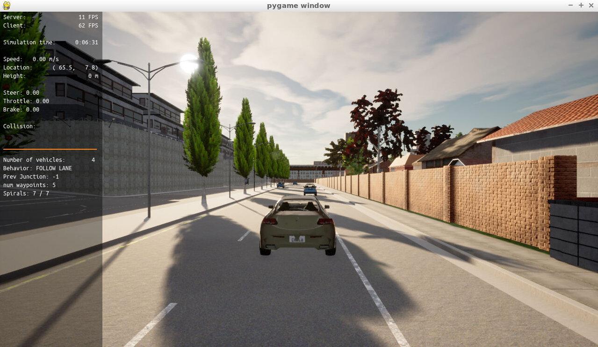
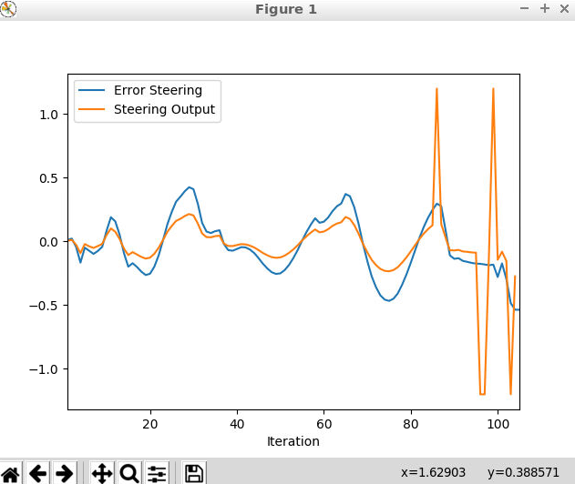
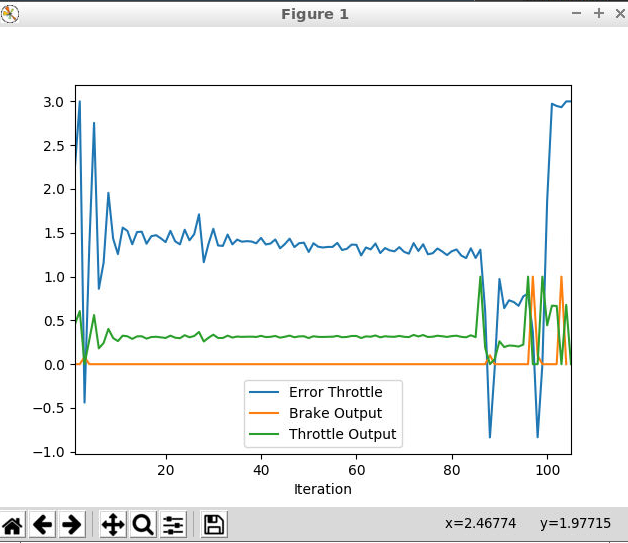

# Udacity Control and Trajectory Tracking for Autonomous Vehicle

### The code and results
Find the results graphs and videos in folder images above with some fail trials videos as I am trying to tune the pid to have final 2 accepted but not so good trials.

Find the codes used exists separtly as named main.cpp , pid_controller.cpp and pid_controller.h. 
it is possible to take those codes content to copy in Udacity workspace instead of exist codes and run
or follow installation method to have same results.

### Installation

Run the following commands to install the starter code in the Udacity Workspace:

Clone the <a href="https://github.com/Shenhapy/Udacity_Control-and-Trajectory-Tracking_project.git" target="_blank">repository</a>:

`git clone https://github.com/Shenhapy/Udacity_Control-and-Trajectory-Tracking_project.git`

## Run Carla Simulator

Open new window

* `su - student`
// Will say permission denied, ignore and continue
* `cd /opt/carla-simulator/`
* `SDL_VIDEODRIVER=offscreen ./CarlaUE4.sh -opengl`

## Compile and Run the Controller

Open new window

* `cd Udacity_Control-and-Trajectory-Tracking_project/project`
* `./install-ubuntu.sh`
* `cd pid_controller/`
* `rm -rf rpclib`
* `git clone https://github.com/rpclib/rpclib.git`
* `cmake .`
* `make` (This last command compiles your c++ code, run it after every change in your code)

## Testing

To test your installation run the following commands.

* `cd Udacity_Control-and-Trajectory-Tracking_project/project`
* `./run_main_pid.sh`
This will silently fail `ctrl + C` to stop
* `./run_main_pid.sh` (again)
Go to desktop mode to see CARLA

If error bind is already in use, or address already being used

* `ps -aux | grep carla`
* `kill id`

## The Project

I build the steer and throttle controller so that the car follows the trajectory.

In the directory [/pid_controller](https://github.com/udacity/nd013-c6-control-starter/tree/master/project/pid_controller)  you will find the files [pid_controller.cpp](https://github.com/udacity/nd013-c6-control-starter/blob/master/project/pid_controller/pid_controller.cpp)  and [pid_controller.h](https://github.com/udacity/nd013-c6-control-starter/blob/master/project/pid_controller/pid_controller.h). This is where you will code your pid controller.
The function pid is called in [main.cpp](https://github.com/udacity/nd013-c6-control-starter/blob/master/project/pid_controller/main.cpp).

### Step 1: Build the PID controller object
Complete the TODO in the [pid_controller.h](https://github.com/udacity/nd013-c6-control-starter/blob/master/project/pid_controller/pid_controller.h) and [pid_controller.cpp](https://github.com/udacity/nd013-c6-control-starter/blob/master/project/pid_controller/pid_controller.cpp).

Run the simulator and see in the desktop mode the car in the CARLA simulator. Take a screenshot and add it to your report. The car should not move in the simulation.
To find this result shown in image below and the car not moving

### Step 2: PID controller for throttle and steer:
In [main.cpp](https://github.com/udacity/nd013-c6-control-starter/blob/master/project/pid_controller/main.cpp)
The code Commented and I Tuned the parameters of the pid as possible.

Find the result video in folder images with some other videos for tunning trials in folder bad and trio crash
### Step 3: Evaluate the PID efficiency
Finally the evaluation of the results

Q1- Add the plots to your report and explain them (describe what you see)
The Vehicle with moving with good speed as i got the throttle kp to 0.18 and I got ki to 0.004 and kd to 0.005 to have a better dummped output without steady state error but if I increase more i have a bad behaviour with the other pid which is steering to have a Kp of 0.48 but still need a faster response but any increase cause crashes and to have better resonce I got ki to 0.006 and to avoid going over the sidewalk so i start increasing it more than that of throttle to 0.07.

To was a long way with too many trials even more that those uploaded from the recommended values:

Proportional gain (Kp): 0.1

Integral gain (Ki): 0.0001

Derivative gain (Kd): 1.0

Those values meant to be recommended by the project guide but this part is missing so i use Udacity chatbot for help in this part.

Q2- What is the effect of the PID according to the plots, how each part of the PID affects the control command?

The proportional gain (Kp) [Amplifies the error signal] determines how much the controller responds to the current error. A high value of Kp will cause the controller to respond more aggressively to the error, but may also cause overshooting and instability.

The integral gain (Ki) [Eliminate steady-state error signal] determines how much the controller responds to the accumulated error over time. A high value of Ki will cause the controller to respond more aggressively to long-term errors, but may also cause instability and oscillation.

The derivative gain (Kd) [Reduce overshoot and oscillations] determines how much the controller responds to the rate of change of the error by adding a term that is proportional to the derivative of the error signal to reduce overshoot and oscillation. but A high value of Kd will cause the controller to respond more aggressively to sudden changes in the error, but may also cause instability and overshooting.

# Rest of the questions
- How would you design a way to automatically tune the PID parameters?

  Using Twiddle as in lessons it will iterate throght the code to find the best PID parameters to have minimum error
  
- PID controller is a model free controller, i.e. it does not use a model of the car. Could you explain the pros and cons of this type of controller?

Pros: it is easy to understand and can be used in many systems and don't need a model of the system

Cons: Not so easy to tune and not that accurate as other controllers that use the system model

- (Optional) What would you do to improve the PID controller?

Have a better tunned parameters by using Twiddle or even may use Ziegler-Nichols method as I am using a simulation so it will be possible to apply.
